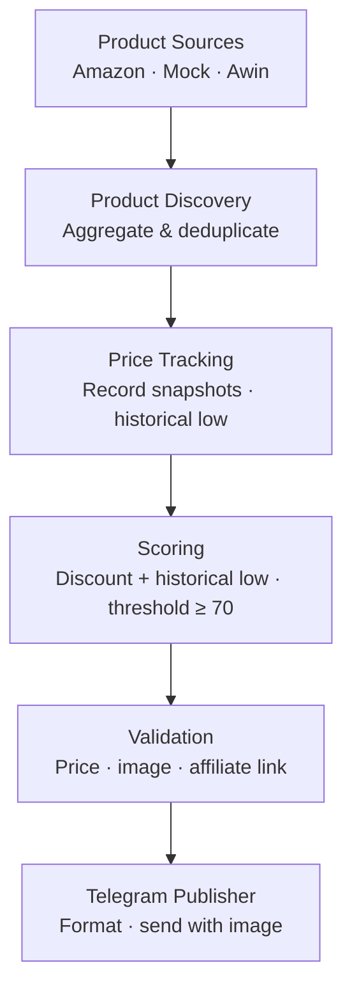

# Oz Deals Bot

An automated affiliate deal discovery and publishing platform for the Australian market. Monitors prices across multiple product sources, identifies genuine discounts through historical price comparison, and publishes qualifying deals to a Telegram channel with affiliate links — entirely without manual curation.

---

## Why?

Finding real deals in Australia is time-consuming. Most aggregators rely on manual submissions or community voting, which introduces delay and subjectivity.

This project automates the full pipeline: from product discovery and price tracking, through scoring and validation, to publishing — so that only deals with measurable, data-backed discounts reach the audience.

---

## Project Vision

The MVP answers one question: **can automated affiliate promotions generate real clicks and sales without human effort?**

If yes, the platform is designed to grow:

- Add real integrations for additional affiliate networks (Awin, Commission Factory)
- Support more retailers alongside Amazon Australia
- Build a richer scoring model as price history accumulates over time

The multi-source architecture makes this extensible from day one. Adding a new retailer means implementing one interface and enabling it in configuration — no changes to the pipeline.

---

## How it works

1. Enabled product sources are queried on a recurring schedule
2. Discovered products are stored and their prices recorded over time
3. Each product is scored by discount depth and proximity to its historical price low
4. Products that pass validation and reach the score threshold are published to Telegram with affiliate links



Product sources implement a common interface and are toggled independently via configuration. Any combination of sources can run simultaneously.

---

## Current Status

MVP in progress. Core pipeline is complete and functional.

- [x] Multi-source product discovery with pluggable source interface
- [x] Price history tracking per product (PostgreSQL)
- [x] Deal scoring: discount depth + historical low comparison
- [x] Telegram publisher with image support and text fallback
- [x] Scheduler with overlap prevention
- [x] Mock source for local testing without any external credentials
- [x] Amazon Australia source (disabled by default pending credentials)
- [x] Awin source placeholder (not yet implemented)
- [ ] Amazon credentials validated end-to-end
- [ ] First real deal published to Telegram

---

## Technology Stack

| Component | Technology |
|---|---|
| Language | Java 21 |
| Framework | Spring Boot 3.3 |
| Persistence | Spring Data JPA + PostgreSQL 16 |
| Scheduling | Spring Scheduler |
| Product data | Amazon PA-API 5 (extensible to other sources) |
| Publishing | Telegram Bot API |
| Containerisation | Docker + Docker Compose |

---

## Setup

### Prerequisites

- Java 21+
- Docker, or a local PostgreSQL 16 instance
- Amazon PA-API credentials — only required when the Amazon source is enabled
- Telegram bot token and channel ID — only required to publish deals

### 1. Configure environment

```bash
cp .env.example .env
# Fill in your values
```

| Variable | Required when |
|---|---|
| `DB_USERNAME` | Always |
| `DB_PASSWORD` | Always |
| `AMAZON_ACCESS_KEY` | Amazon source enabled |
| `AMAZON_SECRET_KEY` | Amazon source enabled |
| `AMAZON_PARTNER_TAG` | Amazon source enabled |
| `TELEGRAM_BOT_TOKEN` | Publishing deals |
| `TELEGRAM_CHANNEL_ID` | Publishing deals |

### 2. Start the database

```bash
docker-compose up -d
```

### 3. Build and run

```bash
./mvnw clean package -DskipTests
./mvnw spring-boot:run
```

The scheduler starts automatically. The default configuration (`sources.mock.enabled=true`) runs the full pipeline locally with no external dependencies — useful for verifying the system before connecting real credentials.

### 4. Enable a real source

Edit `application.properties` to switch sources on or off:

```properties
sources.amazon.enabled=true
sources.mock.enabled=false
sources.awin.enabled=false
```

Each source is independent. Any combination is valid.

### Running tests

```bash
./mvnw test
```

Tests use an H2 in-memory database and require no external services.

---

## Roadmap

- [ ] Validate end-to-end with real Amazon PA-API credentials
- [ ] Publish the first real deal to Telegram
- [ ] Monitor affiliate link clicks and conversions
- [ ] Build a lightweight web dashboard
- [ ] Implement Awin source for additional Australian retailers
- [ ] Tune the score threshold based on observed deal volume
- [ ] Evaluate Commission Factory as an additional affiliate network
